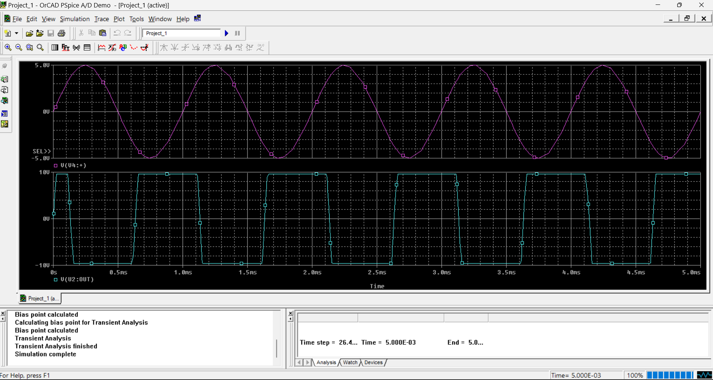
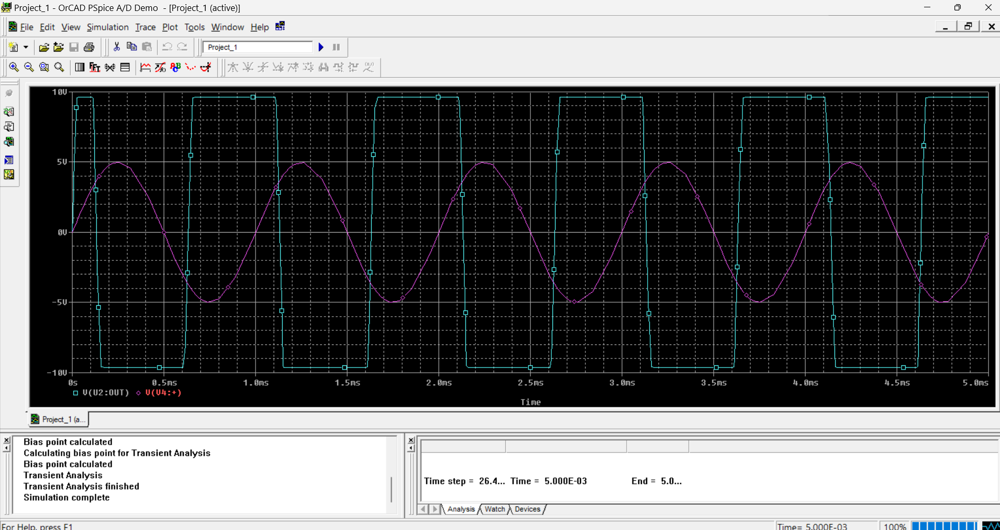

# Schmitt Trigger Simulation using PSpice

This project demonstrates the design and simulation of a Schmitt Trigger circuit using the μA741 operational amplifier in PSpice. The circuit converts a sinusoidal input signal into a square-wave output through regenerative positive feedback.

## Objective

* Design and simulate a Schmitt Trigger using PSpice.
* Analyze the response of the circuit to a sinusoidal input.
* Observe the switching behavior of the output signal.

## Tools Used

* PSpice
* μA741 Operational Amplifier
* Analog Circuit Design

## Circuit Diagram

## Simulation Results

### Input and Output Waveforms

## Working Principle

A Schmitt Trigger is a comparator circuit that employs positive feedback to create distinct switching thresholds. When the input signal crosses these thresholds, the output rapidly switches between its positive and negative saturation levels.

In this simulation:

* A sinusoidal input signal is applied to the circuit.
* The μA741 operational amplifier acts as a comparator.
* Positive feedback determines the switching thresholds.
* The output transitions between high and low states, producing a square wave.

## Observations

* The sinusoidal input signal is successfully converted into a square-wave output.
* The output switches sharply between saturation levels.
* The circuit demonstrates the fundamental operation of a Schmitt Trigger using positive feedback.

## Author

**Sandeep Kumar**
B.Tech Electrical Engineering
Delhi Technological University (DTU)

